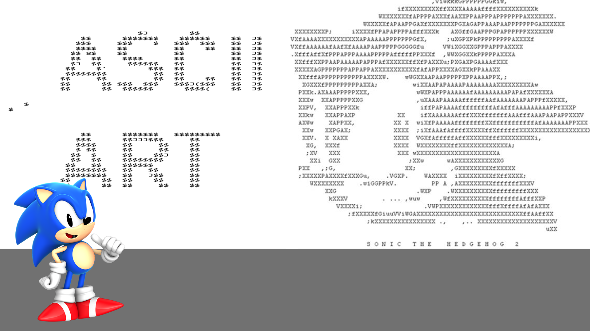

ASCII Art
==========

### First step: Resize to fit in terminal window
    def resize_image(image, new_width=100):
        width, height = image.size
        ratio = height/width
        new_height = int(new_width * ratio)
        resized_image = image.resize((new_width, new_height))
        return(resized_image)

### Second step: Make a black&white(gray scale) image 'cause terminal is grayscale

    def grayify(image):
        grayscale_image = image.convert("L")
        return(grayscale_image)
    
### Third step: Represent each pixel by a ASCII Character
    def pixels_to_ascii(image):
        pixels = image.getdata()

        characters = ""
        for pixel in pixels:
            code = ASCII_CHARS[pixel//24]
            characters+= code
            #print(f"::{pixel} => {code}")

        return(characters) 

Related to this video:  
https://www.youtube.com/watch?v=6QMqgdbSJnk   

To Do
-----    

- [ ] Webcam/Ip camera Support  
- [x] Add comments to code